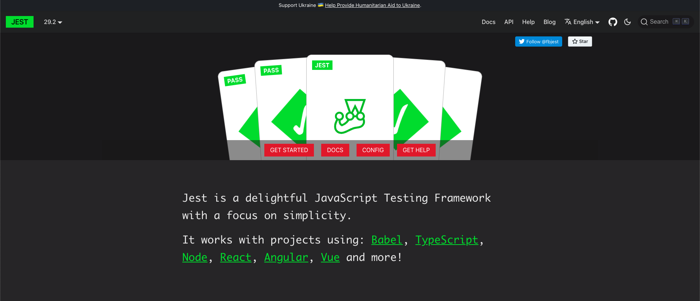

# Tutorial Jest

Repositorio de ejemplo para el tutorial de Jest.

| Ejercicios                                                                                                                                                                           | Version Completa                                                                                                                                                                |
| ------------------------------------------------------------------------------------------------------------------------------------------------------------------------------------ | ------------------------------------------------------------------------------------------------------------------------------------------------------------------------------- |
|  |  |

# Recursos Recomendados

## 01. Documentación oficial de Jest

## 02. Jest Cheatsheets En Devhints

## 03. Jest Cheatsheet de [sapegin](https://github.com/sapegin)

